# How It Works

This is the architecture and implementation guide for
`crypto-portfolio-manager`. It describes today's code, model/Python boundaries,
and the records that make a review auditable.

The Skill is Python-first. The running Skill uses models for screenshot
extraction, bounded semantic interpretation, unresolved web fallback, and
prose, while Python validates inputs, routes on-demand structured providers,
and owns deterministic portfolio mathematics. The system is advisory-only: it
can calculate proposed exposure and staged execution zones, but it never
places trades.

The documentation map is:

```text
[README](README.md)          -> overview and installation
[USAGE](USAGE.md)            -> user workflow and troubleshooting
[HOW_IT_WORKS](HOW_IT_WORKS.md) -> architecture and internal flow
```

## System at a Glance

`SKILL.md` orchestrates the review and calls the typed models and deterministic
engines below. `AcquisitionManager` and `ProviderRouter` perform the
cache-first structured acquisition; normalization, calculations, gates,
packets, and persistence are Python work.

```mermaid
flowchart TD
    A[Portfolio screenshot or structured snapshot] --> B[LUNA_MAX screenshot extraction]
    B --> C[Python snapshot validation and Position PnL]
    C --> D[Python history context and resolved policy]
    D --> E[Python metric collection plan]
    E --> F[Fresh observation cache]
    F --> G[Provider Router and provider cache]
    G --> H[Free public APIs]
    H --> I[Optional API-key providers]
    I --> J[Web fallback requests only]
    J --> K[Python normalization, MetricObservation, CollectionEvent]
    G --> E1[EventScanner source plan]
    E1 --> E2[Pass 1: serialized source requests]
    E2 --> E3[Runtime checks allowlisted event sources]
    E3 --> E4[Pass 2: typed source responses]
    E4 --> K
    K --> L[Python metric history and deterministic Facts]
    L --> M[Python deterministic factors]
    L --> N[LUNA_MAX bounded semantic factor judgment]
    M --> O[Python weighted scoring]
    N --> O
    O --> P[Python market regime]
    P --> Q[Python target allocation]
    Q --> R[Python portfolio risk gate]
    R --> S[Python rebalance and dollar reconciliation]
    S --> T{Approved INCREASE?}
    T -- No --> U[NO_TRADE / HOLD / WAIT / REDUCE / EXIT]
    T -- Yes --> V[Structured spot and OHLCV acquisition]
    V --> W[Python TechnicalSnapshot and Volume Profile]
    W --> X[Python pullback ExecutionPlan]
    U --> Y[DecisionReviewPacket]
    X --> Y
    Y --> Z{Python Sol review predicate}
    Z -- Required --> AA[SOL high-impact critique]
    Z -- Skipped --> AB[No Sol review]
    AA --> AC[Immutable ReportPacket]
    AB --> AC
    AC --> AD[LUNA_MAX Chinese report]
    AD --> AE[Validated append-only local state]
```



Allocation and rebalance approve an `INCREASE` amount first. Technical planning
can stage less or return `WAIT`; it cannot authorize more risk or submit an
order.

## Python-First Decision Boundary

If a result can be derived deterministically from structured data, Python owns
it. LLMs are used only for acquisition, ambiguity resolution, bounded semantic
interpretation, high-impact critique, and prose. A model does not invent
metric keys, recompute a portfolio score, change a target weight, or rewrite a
finalized amount.

| Responsibility | Owner | Current boundary |
|---|---|---|
| Screenshot field extraction | `LUNA_MAX` | Reads the visible Binance table or equivalent supplied image. |
| Public metric retrieval | Python providers first | `AcquisitionManager` reuses observations/cache and returns only unresolved requests to `LUNA_MAX`/Web. |
| Metric validation, normalization, and history deltas | Python | Registry types/units, timestamps, freshness, IDs, comparisons, and persistence. |
| Position P&L | Python | `position_pnl.py` calculates remaining-position cost basis and unrealized results. |
| MA / ATR / returns / volatility | Python | `technical.py` and `metrics.py` perform the arithmetic. |
| Volume Profile | Python | `volume_profile.py` bins completed OHLCV and derives levels/nodes. |
| Deterministic factor calculations | Python where implemented | Trend, BTC-relative strength, and numeric flow interpretation are implemented. |
| Hybrid semantic factor interpretation | `LUNA_MAX` in the current balanced profile | Valuation, fundamentals, on-chain, event, and source-conflict meaning can be judged from compact Facts. |
| Weighted scoring | Python | Missing factors are removed and remaining weights are renormalized. |
| Regime / allocation / risk / rebalance | Python | Portfolio constraints and action amounts are deterministic. |
| Major thesis/event review | `SOL`, conditionally | Python decides whether the high-impact critic is needed. |
| Final prose | `LUNA_MAX` in the current balanced profile | Writes the Chinese explanation from finalized structured values. |

Semantic packets reject raw webpages, full metric history, raw OHLCV,
volume-profile bins, and private reasoning. Normalized records and hashes are
retained, but a public page may change after it was read.

## Model Routing

`config/model-routing.json` is a v2 configuration of named model presets,
explicit reasoning efforts, and profiles. The repository default is
`balanced`; `efficient`, `quality`, and `session_compatible` are built in.
Profiles can inherit one parent, and a user-local override can add presets or
change selected stages without editing the repository file.

Routing follows this boundary:

```text
repository defaults -> selected profile -> run override
-> requested StageRoute -> RuntimeCapabilities -> effective StageRoute
```

`crypto_portfolio.model_routing` keeps the requested preset/model/effort
separate from the effective host route. Host capabilities are injected rather
than guessed. A runtime that cannot select a model per stage falls back to
`CURRENT_SESSION / inherit` and records the reason; it never pretends that a
Terra or Luna switch occurred. The default adapter is conservative because
this package does not own host-level dispatch.

The logical stage owners remain:

| Logical owner | Configured stages |
|---|---|
| `LUNA_MAX` (balanced default) | `screenshot_extraction`, `metric_collection`, `normal_source_retrieval`, `source_conflict_resolution`, `factor_semantic_analysis`, `report_generation` |
| `TERRA` (configured quality profile) | `source_conflict_resolution`, `factor_semantic_analysis`, `report_generation` |
| `SOL` | `major_event_analysis`, `high_impact_final_review` |
| `PYTHON` | `history`, `facts`, `metrics_math`, `technical`, `scoring_math`, `regime`, `allocation`, `risk`, `rebalance`, `execution` |

Every Luna-family preset must use `max`. Python-owned stages reject LLM
presets, and collection plans continue to require logical `LUNA_MAX`.
Routing metadata records profile, runtime, configuration hash, and each
requested/effective route without prompts or private reasoning. Inspect it
with `python3 scripts/model_routing.py --show-effective`; see
[references/model-routing.md](references/model-routing.md) for the policy.

## 1. Portfolio Intake and Normalization

The user-facing intake supports a standard Binance wallet-overview screenshot
and a structured snapshot mapping. The image-reading step is outside the
Python importer. Once visible fields are supplied, Python takes over:

```text
visible screenshot fields
    -> BinancePortfolioObservation
    -> PortfolioSnapshot
    -> deterministic Position P&L and weights
```

`crypto_portfolio/importers/binance_screenshot.py` requires USD display
currency, normalizes symbols, rejects duplicate rows, and preserves missing
cost/P&L fields as `null`. In Binance's fixed two-line row layout, the current price is
the top price, average cost is the bottom price, quantity is the top quantity,
and current value is the bottom quantity value. A `--` cost or P&L is unknown,
not zero. A displayed `$0.00` price with positive quantity and value can be
replaced by `value_usd / quantity` and is recorded as a rounding note.

The normalizer checks these identities when the corresponding inputs exist:

```text
quantity * current price       ~= current value
quantity * average cost        ~= cost basis
current value - cost basis     ~= exchange floating P&L
```

Differences within the larger of `$0.05` or `0.5%` are rounding warnings.
Material mismatches are marked unusable for persistence by the snapshot state
writer until verified. If visible position value does not cover a reported
total, the normalized result records visible-value coverage and warns that the
input may be partial.

Structured JSON goes through `models.portfolio.snapshot_from_mapping`.
`scripts/portfolio_snapshot.py` only validates and normalizes it; it does not
fetch market data or produce a complete decision.

Position P&L means current remaining-position unrealized performance. It is
not realized or lifetime P&L, does not reconstruct sales or tax lots, and does
not make cost basis a buy signal.

## 2. Policy and Configuration

`config/policy.json` is the canonical machine-readable investment and
execution policy. It contains the universe, benchmarks, stable/drawdown
limits, scoring and regime rules, rebalance thresholds, Volume Profile
settings, and technical constants. `config/model-routing.json` contains stage
presets, profiles, runtime fallback, stage ownership, and Sol thresholds.

`models.policy.resolve_policy()` loads and validates the canonical policy.
`Policy.classify()` applies one resolved classification to each symbol:
`core`, `satellite`, `stablecoin`, `cash`, or `other`. A top-level snapshot
`config` is an explicit, narrow override of the legacy configuration fields:
core symbols, satellite symbols, stable symbols, `min_stablecoin_weight`, and
`max_portfolio_drawdown`. Lists replace the relevant defaults; overlapping
groups and invalid values fail validation.

Snapshots and decisions can carry the resolved policy and canonical SHA-256
`policy_hash`, preserving historical policy context if the checkout changes.
The full policy remains canonical in [config/policy.json](config/policy.json);
domain rules live in
[references/investment-policy.md](references/investment-policy.md),
[references/scoring-model.md](references/scoring-model.md), and
[references/risk-model.md](references/risk-model.md).

## 3. Local History and Context

Runtime data defaults outside the Git checkout. `CRYPTO_PORTFOLIO_DATA_DIR`
can replace the default root:

```text
~/.local/share/crypto-portfolio-manager/
├── portfolio/snapshots.jsonl
├── decisions/
│   ├── decisions.jsonl
│   └── status-events.jsonl
├── metrics/
│   ├── observations.jsonl
│   └── collection-events.jsonl
├── market-data/sha256/<ohlcv_hash>.json
├── volume-profiles/sha256/<profile_hash>.json
└── provider-cache/
    ├── responses/<provider>/sha256/<request_hash>.json
    └── series/<provider>/<series_key_hash>/manifest.json
```

The state modules have separate responsibilities:

- `portfolio/snapshots.jsonl` stores validated holdings, classification, and
  derived Position P&L.
- `decisions/decisions.jsonl` stores policy context, targets, actions, scores,
  evidence, risk checks, and optional execution plans.
- `status-events.jsonl` stores later status events without editing decisions.
- `metrics/observations.jsonl` stores successful normalized metric points.
- `metrics/collection-events.jsonl` stores every collection outcome.
- The two hash directories store immutable normalized public market artifacts.

`state.context.build_history_context()` loads the latest snapshot and
decision, NAV, previous targets/actions/assessments, Position P&L, metric
history, and full-review timing. A `FULL_REVIEW` is due after at least 14 days.
The first review establishes a baseline and does not fabricate prior
performance.

JSONL writes are append-only, file-locked, flushed, and fsynced. Reads reject
invalid JSON and incomplete final lines; stores reject or explicitly
de-duplicate identical records.

## 4. Metric Planning and Collection

`crypto_portfolio/metrics_registry.py` is the canonical registry. Each
`MetricDefinition` gives a key, factor, expected type, unit, direction,
freshness, criticality, trend-comparison behavior, optional asset scope, and
the `decision_role`/`context_group` that separates scoring factors from
positioning and cycle context.
Examples include:

```text
market.spot_price
fundamentals.tvl
flows.etf_net_7d
relative.return_vs_btc_90d
risk.security_event_status
```

`engine.metric_plan.build_metric_collection_plan()` selects applicable
requests in Python. It includes BTC/global context, held or watchlisted
non-stable assets, BTC-relative requests for non-BTC assets, and discovery
candidates for unknown policy assets. Stablecoin/cash rows are skipped, and
registry scopes remove inapplicable metrics.

The plan is deterministic and review-type validated. `AcquisitionManager` then
checks current `MetricObservation` history, groups unresolved requests into
provider bundles, reuses immutable series, and performs only the missing
on-demand calls. A current cached observation can be marked reusable when it
is still `CURRENT` and within the definition's freshness window, but the plan
does not let a model invent a new metric key. `normalize_collection_results()`
requires exactly one result for each planned `(asset, metric_key)` pair;
omissions, extras, and duplicates fail closed.

### Event scanning

`events/sources.py` is the deterministic allowlist for event evidence.
`EventScanner` turns it into typed `EventSourceScanRequest` values and accepts
typed source responses from the runtime Web stage. Fetched page text is
untrusted evidence: it cannot add URLs, change source scope, execute commands,
or reveal secrets. Python calculates source coverage, material-event status,
and confidence, then uses the existing `EventScanResult` and
`event_scan_observation()` contracts.

Security sources cover Bitcoin Core and the Ethereum Foundation, go-ethereum,
and consensus-client advisories independently; one client does not represent
all Ethereum security. Governance sources cover BIPs/Core releases for BTC and
EIPs, AllCoreDevs coordination, and Ethereum protocol announcements for ETH.
Regulatory work is one shared market scan over the configured SEC, CFTC, and
ESMA/MiCA primary-source scope, then mapped to BTC/ETH/other affected assets.
This is not a global regulator crawler.

Acquisition does not enter scoring while a hard-critical event source plan is
pending. The first pass exposes `pending_event_scans` and
`ready_for_scoring=False`; the runtime can return serializable responses and a
second acquisition pass synthesizes the scan. Explicit incomplete coverage is
retained as a failure, not converted into a no-event success.

`observed_at` for an event observation is always `scan_as_of`. An old incident
publication therefore does not make a successfully completed current scan
stale. Full primary coverage with no material result is
`NO_KNOWN_MATERIAL_EVENT_IN_SCANNED_SOURCES`; lower coverage is
`INSUFFICIENT_SOURCE_COVERAGE`, never a claim of safety.

The registry also includes derivatives (`derivatives.*`), structured social
(`sentiment.*`), and BTC on-chain (`onchain.btc.*`) observations. They are
`POSITIONING_OVERLAY` or `CYCLE_CONTEXT` definitions, not additions to the
seven base scoring weights.

## 5. Collection Status and Data Quality

The collection boundary accepts exactly these statuses:

```text
SUCCESS | FAILED | STALE | CONFLICT | NOT_APPLICABLE
```

`SUCCESS` becomes a validated `MetricObservation`. Other outcomes remain
visible as `CollectionEvent` records but never become positive evidence.
`CollectionReporter` prints compact progress, persists both record types, and
summarizes counts, critical failures, weighted coverage, and confidence.

`CollectionEvent` is acquisition telemetry, not an investment signal.
`NOT_APPLICABLE` is excluded from coverage; an applicable failure, stale value,
or conflict lowers coverage/confidence. Critical failures such as current
price or unresolved material security status block high-conviction trades.
Missing data is never converted into a favorable score.

The summary keeps per-request coverage for diagnostics and computes decision
coverage by factor using the canonical policy weights. Confidence thresholds
come from `policy.scoring`; hard-critical failures override coverage.

Event criticality is review-aware. Security and chain liveness are hard
critical for `SNAPSHOT_REVIEW`, `FULL_REVIEW`, and `EVENT_REVIEW`. Governance
and regulatory metrics remain requested in all reviews, but are not hard
critical in snapshot/full reviews; an event review treats them as hard
critical. Their failures still reduce coverage and remain visible.

The normalized observation retains source, observed time, fetched time,
freshness, confidence, unit, period, summary, and optional metadata. Its
stable identity is derived from asset, metric key, observed time, source,
value, and period. Revisions must explicitly supersede the prior observation.

## 6. Historical Metrics and Deterministic Facts

Successful observations are sparse timestamped points, not an implied daily
series. `state.metrics` provides sorted latest/previous/series comparisons
with changes, elapsed time, trends, IDs, freshness, and quality flags. Current
data is still refetched; history only provides context.

`engine.metric_history.build_factor_facts()` groups observations by metric and
factor, selects the latest earlier point, and calculates changes in Python.
The immutable `FactBase` subtype contains:

```text
current values + previous values + changes + trend labels
    + coverage + freshness + source/observation IDs + quality flags
```

Available typed fact families are Trend, Valuation, Fundamental, On-chain,
Flow, Relative Strength, and Event facts. `AssetFactorPacket` combines those
facts for one asset and carries a prior assessment and de-duplicated evidence
IDs. Semantic stages receive this compact packet, not raw history or source
pages.

### Positioning and BTC cycle overlays

After collection, the deterministic overlay path is:

```text
Metric collection
    → base Facts → base score
    + PositioningFacts
    + BTCCycleContext
    → risk/execution context
```

`engine.positioning` requires compatible multi-signal derivatives evidence for
`CROWDED` and `EXTREME`; a single funding print or social euphoria is not
enough. `engine.cycle` computes halving deltas, optional valuation and holder
states, and requires non-clock confirmation for elevated/high cycle risk. The
halving clock alone is descriptive and has no action authority.

`MarketOverlays` carries compact states, reasons, evidence IDs, and provenance.
It never enters `FactorScore`, scoring coverage, target-weight arithmetic, or
an independent `EXIT`. Execution combines caps with `min(base, positioning,
cycle)`, so target and approved rebalance amounts remain unchanged while
immediate staging may be reduced or held back.

## 7. Asset Factors and Scoring

The canonical policy defines the taxonomy and weights; see
[references/scoring-model.md](references/scoring-model.md). The implementation
split is narrower than the conceptual taxonomy:

- `engine.factors.trend.calculate_trend_factor()` scores available moving
  averages, MA alignment, calendar returns, drawdown, support structure, and
  volume state from a validated `TechnicalSnapshot`. It reports coverage and
  reasons.
- `engine.factors.relative_strength.calculate_relative_strength()` compares
  30D, 90D, and 180D asset returns with matching BTC returns, derives an
  excess-return score/state, relative drawdown, pair trend, and coverage.
- `engine.factors.flows` deterministically classifies numeric flow as
  `POSITIVE`, `NEUTRAL`, `NEGATIVE`, or `UNKNOWN`; the numeric flow score is
  correspondingly bounded.
- The valuation, fundamentals, on-chain, and event-risk factor modules expose
  typed Fact builders. Their asset-specific meaning is supplied as bounded
  semantic judgment, represented by `FactorJudgment`, and checked against
  structured evidence.

`engine.scoring.score_factors()` validates scores and factor keys, removes
missing non-zero-weight factors, renormalizes the remaining weights, and
returns a `ScoreResult` with effective weights, missing factors, coverage, and
confidence. Critical incompleteness forces low confidence; coverage thresholds
cap possible confidence. Therefore:

```text
score is not confidence
score is not a trade signal
```

An asset score is only an input to regime, portfolio allocation, risk, target
deviation, and rebalance logic. A missing BTC-relative comparison for a
satellite is `HOLD_ONLY`: existing exposure may be preserved, but the missing
comparison cannot justify new risk.

## 8. Portfolio Decision Pipeline

The deterministic portfolio path is:

```text
AssetAssessment
    -> RegimeInputs
    -> market regime
    -> target allocation
    -> portfolio risk gate
    -> current-versus-target rebalance
    -> NO_TRADE / HOLD / WAIT / INCREASE / REDUCE / EXIT
```

`regime_inputs.py` converts BTC technical context, flow Facts, breadth, and
cash-flow-aware drawdown into `RegimeInputs`. `regime.py` combines trend,
volatility, drawdown, flows, and breadth; a severe systemic event overrides
confirmation, and unknown inputs lower confidence. Drawdown floors apply from
the resolved budget: at `-0.60D` the regime cannot remain `NORMAL`, at
`-0.80D` it is at least `CAPITAL_PRESERVATION`, and below `-D` is a breach.

`allocation.py` uses the regime envelope, stable target, classification, score,
confidence, critical-data flag, thesis/event flags, risk tier, and BTC-relative
eligibility. Stable exposure is at least the larger of global floor and regime
target. Satellite targets are capped by the regime and single-asset limits;
existing stable symbols are scaled rather than swapped for a preferred symbol.

`risk.py` checks target sum, stable exposure, satellite/core/single-asset
limits, drawdown guardrails, severe-event exposure, low-confidence satellites,
and high-beta information. The Skill stops on an `ERROR`; warnings and info
remain context. Portfolio risk outranks a single asset's score.

`rebalance.py` uses economic dollars after new cash:

```text
current amount = current weight * existing value
post total     = existing value + new cash
target amount  = target weight * post total
```

Unallocated value and new cash enter the stable sleeve. Absolute deviations use
configured hold/watch/active/high-priority thresholds. `RebalanceAction`
requires a positive amount for `INCREASE`, `REDUCE`, and `EXIT`; `HOLD`,
`WAIT`, and `NO_TRADE` carry zero. Trade dollars reconcile new cash plus sales
minus risky-asset purchases. A buy request never makes deployment mandatory.

## 9. Accounting, NAV, Drawdown, and Benchmarks

Three deliberately different performance concepts are kept separate:

1. Position P&L is the current unrealized result for a remaining position
   against usable current cost data.
2. Portfolio NAV return is cash-flow-adjusted portfolio performance.
3. Benchmark comparison is a period-aligned comparison against configured
   buy-and-hold benchmarks.

`engine.ledger.build_nav_history()` uses unitized NAV. A flow attached to a
snapshot occurs immediately before valuation:

```text
pre-flow value = snapshot value - flow
pre-flow NAV   = pre-flow value / existing units
units added    = flow / pre-flow NAV
new NAV        = snapshot value / new units
```

The initial snapshot must have zero external flow and times must be strictly
increasing. The ledger requires positive finite pre-flow value, units, and NAV.
Deposits and withdrawals change units, not investment return; drawdown comes
from NAV rather than raw balance changes.

`engine.benchmark.py` keeps periods aligned. The primary benchmark is 100% BTC
buy-and-hold; the secondary is 70% BTC / 30% ETH buy-and-hold, with each flow
allocated 70/30 at the boundary. It is not daily rebalanced. Missing held-asset
returns fail rather than renormalizing remaining weights.

## 10. Technical Execution Is Downstream of Allocation

The central invariant is:

```text
Portfolio/Rebalance engine decides WHETHER and HOW MUCH exposure is allowed.
Execution decides HOW to stage only that approved amount.
```

The technical path is:

```text
approved INCREASE RebalanceAction
    -> timestamped SpotPrice + normalized 1D OHLCV
    -> completed-candle and replay checks
    -> TechnicalSnapshot
    -> structural zones and setup quality
    -> staged ExecutionPlan or WAIT
```

### Market time and replay semantics

`SpotPrice` requires a positive price, source, and timezone-aware
`observed_at`; `fetched_at` is separate retrieval metadata. A bare spot float
is allowed only in the non-replay convenience path; historical replay
requires a timestamped `SpotPrice`. `OHLCVSeries` accepts `1H`, `4H`, or `1D`,
requires increasing timestamps, and rejects duplicate daily UTC dates.
Indicators use completed candles only. With `as_of`, candle intervals must be
closed and the spot cannot be later than `as_of`; a recent fetch does not make
old candles current.

The daily snapshot measures calendar coverage, missing days, gaps, observation
lag, provenance, retrieval age, and spot-to-last-close gap. The policy prefers
at least 120 completed candles and 365 days for strongest confidence; coverage
uses calendar time rather than invented candles. Source, venue/market/quote,
fetch times, and the canonical OHLCV hash are retained.

### Daily technical engine

`engine.technical.build_technical_snapshot()` is authoritative on `1D` data.
It currently computes:

- simple MA20, MA50, MA100, and MA200 when enough closes exist;
- calendar-based 30D, 90D, and 180D close-to-close returns;
- ATR14 as the simple mean of 14 fully defined true ranges, requiring 15
  candles including the preceding close;
- annualized realized volatility over configured 30D and 90D calendar windows;
- a prior-20-candle volume average and relative volume;
- historical high, distance from that high, and current drawdown;
- confirmed swing highs and lows with the configured number of completed bars
  on both sides; and
- ATR-aware MA, swing, and Volume Profile support/resistance zones clustered by
  separation and maximum span.

Insufficient/stale data, cadence gaps, incomplete provenance, unreliable
volume, unavailable ATR, spot/close gaps, and provenance mismatches become
quality flags. Setup quality is separate from data confidence: good history
does not turn a weak zone into an entry.

## 11. Volume Profile and Historical Traded-Volume Structure

`engine.volume_profile.build_volume_profile()` uses only completed bars and
accepts `1H`, `4H`, and `1D`. The policy prefers intraday data (normally 4H;
1H is also supported) from one consistent liquid spot venue. If explicitly
allowed, daily data is a lower-resolution approximation whose confidence is
capped at `MEDIUM`.

For each lookback horizon, the algorithm:

1. selects completed bars in the requested calendar lookback;
2. assigns each bar's volume to the representative price
   `(high + low + close) / 3`;
3. bins those prices into the configured fixed number of price bins;
4. selects the POC as the highest-volume bin, breaking ties toward the lower
   price;
5. expands the value area outward from the POC until the configured volume
   fraction is reached, choosing the larger adjacent bin and the lower-price
   side on a tie; and
6. identifies bounded local HVN and LVN nodes, merging nearby nodes by ATR or
   bin width and limiting the number of nodes.

The result contains `POC`, `VAL`, `VAH`, HVN/LVN nodes, coverage metadata,
source, the OHLCV hash, and a content-derived `profile_hash`. Multiple
horizons are retained in compact metadata. POC, value-area levels, and HVNs
can add confluence to existing MA/swing/ATR zones. LVNs are transition
context, not automatic support.

Volume Profile is a historical traded-volume concentration proxy, not an
exact current-holder cost-basis map. It cannot create a portfolio allocation
or trade without an approved rebalance action.

## Entry Planner Limitations

`engine.entry.build_entry_plan()` accepts only an approved `INCREASE`. It does
not build reduction or exit plans. In v1, `PULLBACK` is the only generating
mode. `BREAKOUT` always returns a zero-deployment `WAIT` plan, even if callers
provide breakout or BTC-relative confirmation flags; the breakout/retest
planner is not implemented. `MIXED` is rejected as an invalid mode.

For a pullback, the planner ranks confirmed support zones by confluence, source
quality, ATR distance, volume context, and strength. It selects the nearest
qualified zone first, adds separated zones up to the policy limit, applies the
regime/volatility template, and scales deployment by portfolio and technical
confidence. A plan may stage less than approved; tranche fractions sum to one
and amounts sum to `planned_amount_usd`.

`ExecutionPlan` v2 retains the approved amount, staged amount, unallocated
amount, price zones, reference prices, approximate quantities, technical
summary, OHLCV/profile hashes, and a review-only invalidation. The invalidation
cannot be an automatic order. A plan is persisted only when it matches exactly
one same-symbol approved `INCREASE` action at the same amount and its
`execution_technical` evidence matches the technical summary and hashes.

When supplied, `PositioningFacts` and `BTCCycleContext` are execution context,
not allocation inputs. Long-crowded/high positioning and cycle risk apply the
configured deployment caps; their combination uses the minimum cap rather than
multiplying penalties. Confirmed technical extension plus long crowding may
return `WAIT`. Deleveraging only removes a crowding penalty and never boosts the
base plan.

## 12. Compact Review Packets

Packets are the handoff boundary between Python and model stages:

- `AssetFactorPacket` contains compact typed Facts, coverage, previous
  assessment, and evidence IDs for one asset.
- `DecisionReviewPacket` contains normalized per-asset summaries, current and
  target weights, previous targets, actions, execution summary, risk flags,
  critical missing data, conflicts, high-impact flags, and compact positioning/
  BTC-cycle overlay outcomes with effective deployment caps.
- `ReportPacket` contains the finalized regime, scores, weights, actions,
  approved amounts, zones, historical changes, risk flags, optional Sol review,
  data-quality summary, and immutable overlay outcomes.

The packet models are frozen dataclasses. Nested values are frozen or
validated, raw/full-history keys are rejected, and score/weight/amount/action
invariants are checked at construction. They keep raw webpages, full OHLCV,
metric history, and profile bins out of downstream handoffs.

### Conditional Sol review

Python evaluates `should_run_sol_final_review()` before dispatch. An ordinary
`SNAPSHOT_REVIEW` containing only `HOLD`, `WAIT`, or `NO_TRADE` outcomes and no
material flags can skip Sol. The predicate routes an `EXIT`, any active
rebalance action, a core reduction at or above `material_reduce_pp`,
`CAPITAL_PRESERVATION`, a risk-budget breach, broken thesis, severe event,
critical missing data, material conflict, risk escalation, recommendation
reversal, or target change above `material_target_change_pp`. The current
thresholds are 5pp and 10pp.
Non-snapshot review types are not treated as the ordinary low-impact shortcut.

Sol returns a bounded `SolReview` status and rationale. It does not perform or
override deterministic financial arithmetic.

### Report generation

`engine.report_packet.build_report_packet()` creates the finalized report
input from the decision packet and optional Sol review. The Skill sends those
values to Terra for Chinese prose using
[references/output-template.md](references/output-template.md). Report prose
may explain scores, weights, actions, amounts, zones, risk flags, evidence,
and uncertainty, but it must not recompute or alter the finalized values.

## Implementation Map

| Area | Key implementation |
|---|---|
| Policy | [`config/policy.json`](config/policy.json), [`models/policy.py`](crypto_portfolio/models/policy.py) |
| Model routing | [`config/model-routing.json`](config/model-routing.json), [`model_routing.py`](crypto_portfolio/model_routing.py) |
| Portfolio intake | [`binance_screenshot.py`](crypto_portfolio/importers/binance_screenshot.py), [`models/portfolio.py`](crypto_portfolio/models/portfolio.py) |
| Metric registry | [`metrics_registry.py`](crypto_portfolio/metrics_registry.py) |
| Metric collection planning | [`engine/metric_plan.py`](crypto_portfolio/engine/metric_plan.py) |
| Metric normalization/history | [`engine/metric_normalization.py`](crypto_portfolio/engine/metric_normalization.py), [`engine/metric_history.py`](crypto_portfolio/engine/metric_history.py), [`state/metrics.py`](crypto_portfolio/state/metrics.py) |
| Event scanning | [`events/sources.py`](crypto_portfolio/events/sources.py), [`events/scanner.py`](crypto_portfolio/events/scanner.py), [`models/events.py`](crypto_portfolio/models/events.py) |
| Facts | [`facts/`](crypto_portfolio/facts/), [`engine/facts.py`](crypto_portfolio/engine/facts.py) |
| Positioning overlay | [`engine/positioning.py`](crypto_portfolio/engine/positioning.py), [`models/positioning.py`](crypto_portfolio/models/positioning.py) |
| BTC cycle context | [`engine/cycle.py`](crypto_portfolio/engine/cycle.py), [`models/cycle.py`](crypto_portfolio/models/cycle.py) |
| Overlay container/caps | [`models/market_overlays.py`](crypto_portfolio/models/market_overlays.py), [`engine/overlays.py`](crypto_portfolio/engine/overlays.py) |
| Factors | [`engine/factors/`](crypto_portfolio/engine/factors/) |
| Scoring | [`engine/scoring.py`](crypto_portfolio/engine/scoring.py) |
| Regime | [`engine/regime_inputs.py`](crypto_portfolio/engine/regime_inputs.py), [`engine/regime.py`](crypto_portfolio/engine/regime.py) |
| Portfolio construction | [`engine/allocation.py`](crypto_portfolio/engine/allocation.py), [`engine/risk.py`](crypto_portfolio/engine/risk.py), [`engine/rebalance.py`](crypto_portfolio/engine/rebalance.py) |
| Accounting | [`engine/ledger.py`](crypto_portfolio/engine/ledger.py), [`engine/benchmark.py`](crypto_portfolio/engine/benchmark.py), [`engine/position_pnl.py`](crypto_portfolio/engine/position_pnl.py) |
| Technicals | [`engine/technical.py`](crypto_portfolio/engine/technical.py) |
| Volume Profile | [`engine/volume_profile.py`](crypto_portfolio/engine/volume_profile.py), [`models/volume_profile.py`](crypto_portfolio/models/volume_profile.py) |
| Execution | [`engine/entry.py`](crypto_portfolio/engine/entry.py), [`engine/execution.py`](crypto_portfolio/engine/execution.py), [`models/execution.py`](crypto_portfolio/models/execution.py) |
| Packets | [`models/factor_packet.py`](crypto_portfolio/models/factor_packet.py), [`models/decision_packet.py`](crypto_portfolio/models/decision_packet.py), [`models/report_packet.py`](crypto_portfolio/models/report_packet.py) |
| Runtime state | [`crypto_portfolio/state/`](crypto_portfolio/state/) |
| Providers | [`providers/base.py`](crypto_portfolio/providers/base.py), [`providers/coinglass.py`](crypto_portfolio/providers/coinglass.py) |
| Validation contracts | [`schemas/`](schemas/) |

The runtime instructions that connect these pieces are in
[`SKILL.md`](SKILL.md); the domain rules remain in the focused reference
documents, including [decision rules](references/decision-rules.md) and
[data-source policy](references/data-sources.md).

## Provider Boundary

`crypto_portfolio/providers/base.py` defines protocols, typed requests,
capabilities, fetch modes, and handled provider errors. The concrete public
adapters use the stdlib HTTP client and normalize into registry/model
contracts. Binance and Bybit are public market/derivatives sources;
DeFiLlama, Alternative.me, and catalog-aware Coin Metrics cover selected
structured context. The optional CoinGlass V4 adapter uses an environment-only
API key for ETF flow and historical liquidation bundles. The adapters never
expose private account or trading endpoints.

`AcquisitionManager` owns the order `observation -> provider cache -> free API
-> optional API-key provider -> Web fallback`. The Skill maps only unresolved
fallback work into model stages before portfolio logic. Event metrics use the
dedicated allowlisted EventScanner boundary and return typed source requests;
they are not generic one-line web fallbacks. `scripts/` contains read-only
provider and cache diagnostics. Provider status distinguishes configuration,
adapter availability, credential presence, and runtime readiness offline;
`scripts/providers.py --probe ...` is the separate opt-in network check. HTTPS
uses a verified context and retains safe transport error codes.

## Persistence and Replay

The persistence design answers:

```text
What did the system know?
What policy was applied?
What evidence supported the score?
What market inputs produced the execution plan?
```

Snapshots and decisions retain IDs, timestamps, policy version, resolved
policy, and policy hash where applicable. Persisted decisions require complete
`Evidence` objects; factor references must resolve to the same asset/factor.
Execution plans retain compact technical summaries, `execution_technical`
evidence, and OHLCV/profile hashes. Status changes are separate events.

Normalized OHLCV is content-addressed by `OHLCVSeries.ohlcv_hash`; Volume
Profiles have a content-derived `profile_hash` and source OHLCV hash.
`state.market_data` refuses different content under an existing hash, so the
same normalized inputs and `as_of` reproduce deterministic snapshots, zones,
and plans. Metric observations retain source and identity too.

Normalized inputs and deterministic outputs are replayable. Public-page
interpretation, source availability, and live model responses are not
guaranteed reproducible merely because IDs were stored.

## Failure and Safety Modes

The system fails toward less actionability:

- `FAILED`, `STALE`, and `CONFLICT` collection events remain visible and lower
  coverage/confidence; they are not successful evidence.
- `NOT_APPLICABLE` excludes a metric from applicable coverage rather than
  pretending it is missing or positive.
- Critical data failure, partial screenshot coverage, stale/insufficient data,
  unresolved conflict, or low confidence can block a strong entry.
- A risk-gate `ERROR` prevents the Skill from proceeding with the unsafe
  target.
- Technical freshness, cadence, provenance, extreme volatility, weak setup
  quality, or capital-preservation regime returns `WAIT` or leaves capacity
  unallocated.
- `NO_TRADE` is a valid portfolio result, not an error.
- Invalid amounts, unmatched approval, bad hashes/timestamps, unresolved
  evidence, or schema/model mismatches fail before persistence.

The core rule is:

```text
uncertainty reduces actionability rather than being guessed away
```

## End-to-End Synthetic Example

The following is synthetic and is not a live recommendation or executable
portfolio. Assume a custom policy classifies fake `AAA` as a core asset and
fake `BBB` as a satellite, with `USD` as the stable sleeve:

1. The user supplies a screenshot containing `AAA`, `BBB`, and `USD` rows.
   `LUNA_MAX` extracts visible values; Python validates the rows and computes
   Position P&L where cost data exists.
2. Python loads the resolved policy and local history, then builds a registry
   metric plan. Suppose `AAA` has current market metrics and `BBB` is missing
   its BTC-relative history.
3. `LUNA_MAX` returns the requested observations. Python normalizes them,
   appends successful observations and every collection status, and derives
   current/previous Facts.
4. Deterministic technical, relative-strength, and flow calculations combine
   with bounded semantic judgments for the fake asset-specific factors.
5. Python scores the factors, reduces confidence for the missing `BBB`
   comparison, and marks that satellite `HOLD_ONLY` rather than inventing a
   favorable relative result.
6. Python derives regime inputs, selects a regime, builds bounded targets,
   applies the stable floor and concentration limits, then runs the risk gate.
7. The rebalance engine calculates post-new-cash economic dollars. Suppose it
   approves a synthetic `$1,000` `AAA` increase while leaving `$500` of new
   cash in the stable sleeve.
8. For the approved increase, current timestamped spot plus completed daily
   OHLCV passes replay and coverage checks. Python derives MA/ATR/swing
   structure and a multi-horizon Volume Profile, then stages only a portion of
   the `$1,000` capacity in pullback tranches.
9. Python evaluates the Sol predicate. It invokes the critic only if the
   packet is high-impact under the current rules; otherwise the packet skips
   Sol.
10. Python builds an immutable `ReportPacket`; Terra explains the finalized
    values in Chinese; validated snapshot, decision, evidence, and public
    market artifacts are appended to local state.

Every symbol and value above is illustrative; real metrics, limits, evidence,
and actions come from current inputs and canonical configuration.

## What It Does Not Do

- It does not place automatic orders or perform exchange trading or withdrawals.
- It does not request or store exchange trading keys, withdrawal credentials,
  seed phrases, or private keys.
- It does not implement futures, perpetuals, leverage, margin, or liquidation
  logic.
- It does not reconstruct realized lifetime P&L, sales, tax lots, or historical
  fees from a screenshot.
- Cost basis is reporting/risk context, not a buy signal or sunk-cost rule.
- Volume Profile is not exact holder cost basis.
- Free-form LLM arithmetic does not override deterministic finance produced by
  Python.
- A drawdown budget is a risk objective, not a guaranteed maximum loss.

## Extension Points

These are interfaces for future work, not implemented promises:

- additional read-only provider adapters behind the provider protocols;
- additional registry-defined metrics and deterministic factors;
- additional policy-defined benchmarks;
- a breakout/retest planner with its own evidence gates and invalidation;
- a transaction ledger for realized P&L and tax-lot-aware history; and
- higher-resolution trade-level volume data beyond the current bar-level
  Volume Profile approximation.

Any future execution integration would need to remain isolated from analysis,
require explicit confirmation, and receive a separate security review.

## Reliability and Tests

The test suite covers the principal deterministic contracts: typed
model and schema validation, metric normalization/history, provider HTTP/cache
and fallback behavior, Position P&L,
cash-flow-aware NAV, benchmark alignment, scoring, regime, allocation, risk,
rebalance thresholds, time/replay guards, Volume Profile, execution
reconciliation, model routing, and packet boundaries.

Run the repository checks from its root:

```bash
python3 -m unittest discover -s tests -v
ruff check .
python3 -m compileall crypto_portfolio scripts
```

Use the canonical references for policy and decision semantics:
[investment policy](references/investment-policy.md), [scoring model](references/scoring-model.md),
[risk model](references/risk-model.md), [decision rules](references/decision-rules.md),
[data sources](references/data-sources.md), and [model routing](references/model-routing.md).
